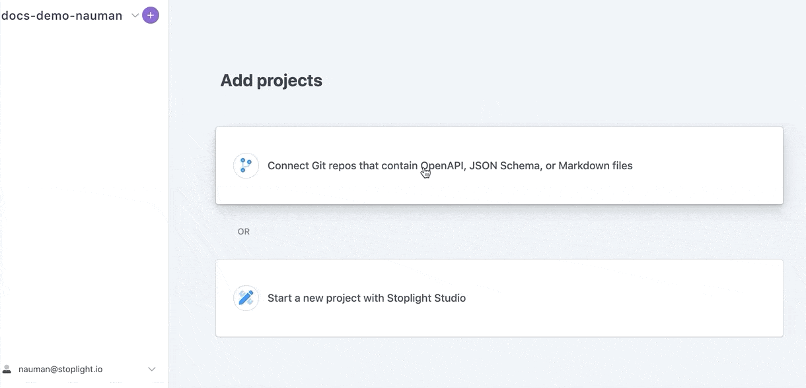
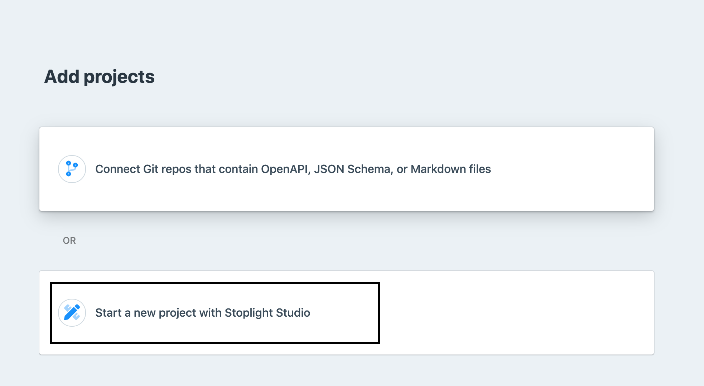
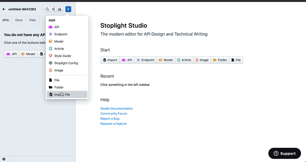
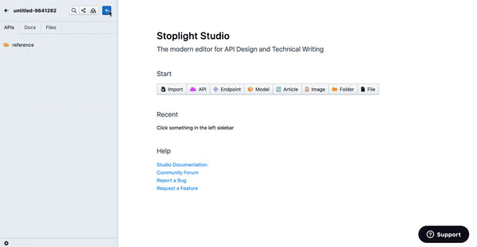
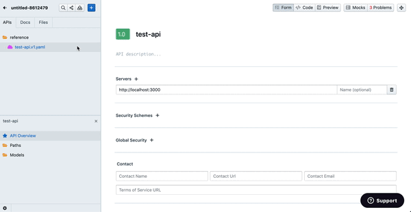
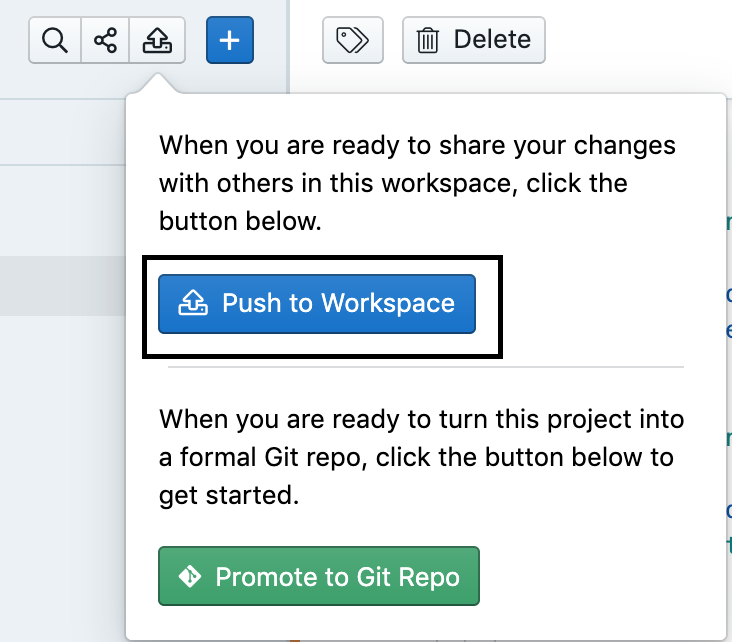

# Add Projects

Projects can contain anything you would expect to find in a repository: source code, API descriptions, images, Markdown articles, maybe some Excel spreadsheets. Stoplight will analyze the contents of a project looking for things it knows what to do with, and ignore the rest.

Stoplight looks for: 

- API Description Documents (OpenAPI v2, OpenAPI v3, and JSON Schema)
- Markdown articles
- Images

## Connect an Existing Git Project

The quickest and recommended way to get projects into Stoplight is to pull them in from Git, and this can be done in Explorer.

1. Click on `+` sign on the top right, then click `Connect Repos`.
2. Click on the Git provider of your choice and then click `Connect with Your Git Provider`. Follow the instructions on the pop-up screen to authenticate.
3. Upon successful authentication, you should see your organizations listed. Choose the organization and select the repositories you want to import. Click `Add Projects`.

If the repository has Markdown articles or API descriptions, then you will see them show up.

Next, lets [share this project](share-documentation-quickstart.md). 

## Import Local Files or Create a Blank Project

If you don't have your API artifacts like OpenAPI or JSON schema on a Git repository or want to get started with creating a new one, you can get started in Studio. 

1. Click on `+` sign on the top right, then click `Start a new project with Stoplight Studio`.

[![New Project][1]][2]

[1]:  ../assets/images/addProjectThumb.png
[2]:  ../assets/images/addProject.png

### Import Existing Files

Click `Import` to Import existing OpenAPI descriptions, JSON Schemas, Images, or Documentation.

Play around, design, and edit using the intuitive interface.  

### Create new API Descriptions or Documentation

Add an OpenAPI description, Json Schema, Article, or Images by clicking on `Add`.

### Promote to a Git repo (Recommended)
To start sharing this project you can promote it to a Git repo. This would create a Git repo and push the imported/newly created content always keeping it in sync with the changes within or outside Studio. 

Click `Push`, then click `Promote to  Git repo`. 

Choose your desired Git provider, organization, and name and click `Create Git Repository`.

Next, commit your changes with a message by clicking `Commit`. 

Next, lets [share this project](share-documentation-quickstart.md). 

### Push to workspace

If you don't want to push this content to a Git repo, you can push it to the workspace to start sharing it.

Give it a useful name. Click `Push`, then click `Push to workspace`. 

Next, lets [share this project](share-documentation-quickstart.md). 
